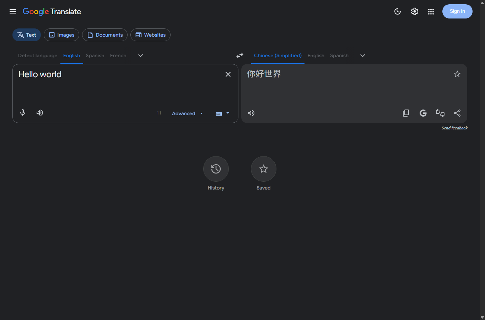

# Google Translate Theme Toggle

给 Google 翻译添加深色模式和主题切换按钮。

安装后，Google Translate 页面右上角会多出一个主题按钮。点击按钮可以在浅色、深色、跟随系统之间切换。

## 脚本效果

- 把 Google Translate 主页面切换为深色界面。
- 支持浅色、深色、跟随系统三种模式。
- 记住上次选择，下次打开 Google Translate 会自动使用同一主题。
- 覆盖翻译输入框、翻译结果、语言选择、历史记录、收藏、词典详情等常见区域。
- 覆盖 Google Apps 面板和账号弹层中的部分浅色区域。
- 不需要额外权限，脚本声明为 `@grant none`。

## 安装方式

### 1. 安装脚本管理器

先在浏览器里安装一个 userscript 管理器：

- Chrome / Edge：Tampermonkey 或 Violentmonkey
- Safari：Userscripts

### 2. 添加脚本

打开本项目里的 `google-translate-dark-mode.user.js`，把脚本内容复制到脚本管理器中新建脚本里，然后保存并启用。

如果你是在 GitHub 上查看这个项目，也可以打开脚本文件的 Raw 页面，让脚本管理器自动识别安装。

### 3. 打开 Google 翻译

访问：

https://translate.google.com/

页面右上角出现主题按钮后，说明脚本已经生效。

## 使用方式

点击右上角主题按钮切换模式：

- 太阳图标：浅色模式
- 月亮图标：深色模式
- 半圆图标：跟随系统

推荐日常使用“跟随系统”。如果你只想一直使用深色界面，切换到月亮图标即可。

## 适用范围

脚本主要适用于 Google Translate 网页版，包括：

- `translate.google.com`
- 常见地区域名，例如 `translate.google.com.hk`
- Google Translate 页面中打开的 Google Apps 面板和账号弹层

Google 页面经常更新，如果某些区域突然恢复浅色，通常是页面结构变了，需要更新脚本适配。

## 常见问题

**安装后没效果怎么办？**

先确认脚本管理器中脚本是启用状态，然后刷新 Google Translate 页面。如果还是没效果，检查当前页面地址是否是 `translate.google.com` 或对应地区域名。

**主题选择会同步到其他浏览器吗？**

不会。主题选择保存在当前浏览器本地。

**脚本会读取我的翻译内容吗？**

脚本不使用网络请求权限，也没有 userscript 特权 API。它主要做页面样式调整和主题状态保存。

## 许可证

当前脚本头部声明为 `GPL-3.0`。如果重新发布或修改发布，请保留原作者和许可证信息。
